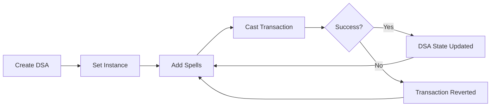

## What are DeFi Smart Accounts?

DeFi Smart Accounts (DSAs) are smart contract wallets that act as a unified proxy to interact with multiple DeFi protocols. Each DSA is a uniquely numbered smart account with its own Ethereum address that enables users to execute complex, multi-step transactions across protocols in a single transaction.

<Info>
Every user can create multiple DSA accounts for different use cases, all controlled by their primary Ethereum address.
</Info>

## Key Features

### Composability

DSAs enable seamless composability across DeFi protocols. You can combine actions from different protocols (Aave, Compound, Uniswap, etc.) into a single transaction, creating complex financial strategies that would otherwise require multiple transactions and higher gas costs.

### Authority Management

Each DSA supports multiple authorities - addresses that are authorized to execute transactions on behalf of the account. This enables:

- Delegation of control to trusted addresses
- Multi-signature functionality
- Automated strategy execution through smart contracts

### Gas Efficiency

By batching multiple protocol interactions into a single transaction, DSAs significantly reduce gas costs compared to executing each action separately.

### Multi-Chain Support

DSAs are deployed across multiple chains:

<CardGroup cols={3}>
  <Card title="Ethereum" icon="ethereum">
    Chain ID: 1
  </Card>
  <Card title="Polygon" icon="hexagon">
    Chain ID: 137
  </Card>
  <Card title="Arbitrum" icon="circle-nodes">
    Chain ID: 42161
  </Card>
  <Card title="Avalanche" icon="mountain">
    Chain ID: 43114
  </Card>
  <Card title="Optimism" icon="circle-o">
    Chain ID: 10
  </Card>
  <Card title="Base" icon="b">
    Chain ID: 8453
  </Card>
</CardGroup>

## How DSAs Work

### Account Structure

Each DSA has three key properties:

```typescript
interface Instance {
  id: number        // Unique DSA identifier
  address: string   // The DSA's Ethereum address
  version: number   // DSA version (1 or 2)
  chainId: ChainId  // The chain where the DSA exists
}
```

### Version Support

DSA supports two versions:

- **Version 1**: Legacy DSA accounts with basic functionality
- **Version 2**: Current standard with enhanced features and optimizations (recommended)

<Note>
When creating a new DSA, version 2 is used by default unless specified otherwise.
</Note>

## Creating a DSA

To create a new DSA account, use the `build()` method:

```javascript
// Simple creation
await dsa.build()

// With custom parameters
await dsa.build({
  authority: '0x...', // Custom authority address
  origin: '0x...',    // Origin for analytics
  version: 2,         // DSA version
  gasPrice: '50',     // Gas price in gwei
  from: '0x...'       // Account creating the DSA
})
```

<Tip>
The `build()` method returns a transaction hash. Once confirmed, the DSA is ready to use.
</Tip>

## Managing DSAs

### Fetching Accounts

Retrieve all DSAs owned by an address:

```javascript
const accounts = await dsa.getAccounts('0x...')
// Returns:
// [
//   {
//     id: 52,
//     address: "0x...",
//     version: 2
//   },
//   ...
// ]
```

### Setting Active Instance

Before casting spells, set which DSA to use:

```javascript
await dsa.setInstance(52) // Use DSA with ID 52
```

All subsequent operations will be executed through this DSA.

### Checking Account Details

Get detailed information about a specific DSA:

```javascript
const details = await dsa.getAccountIdDetails(52)
console.log(details)
// {
//   id: 52,
//   address: "0x...",
//   version: 2,
//   chainId: 1
// }
```

## Authority System

DSAs implement a flexible authority system for access control:

### Adding Authorities

You can authorize additional addresses to control your DSA:

```javascript
// Get current authorities
const authorities = await dsa.getAuthById(dsaId)

// Add new authority using the AUTHORITY-A connector
const spell = dsa.Spell()
spell.add({
  connector: 'AUTHORITY-A',
  method: 'add',
  args: ['0x...'] // New authority address
})
await spell.cast()
```

### Authority Use Cases

<AccordionGroup>
  <Accordion title="Delegation">
    Delegate DSA control to a trusted address for automated operations or strategy execution.
  </Accordion>
  
  <Accordion title="Multi-Sig">
    Add multiple authorities to implement multi-signature functionality for enhanced security.
  </Accordion>
  
  <Accordion title="Smart Contract Automation">
    Authorize smart contracts to execute predefined strategies automatically based on market conditions.
  </Accordion>
</AccordionGroup>

## Security Considerations

<Warning>
DSAs are smart contracts that hold your funds. Only authorize addresses you completely trust, as authorities have full control over the account.
</Warning>

### Best Practices

1. **Verify Authority Addresses**: Always double-check addresses before adding them as authorities
2. **Use Hardware Wallets**: Protect your primary authority address with a hardware wallet
3. **Regular Audits**: Periodically review authorized addresses using `getAuthById()`
4. **Separate Concerns**: Create multiple DSAs for different strategies to isolate risk

## DSA Lifecycle



## Advanced Features

### Flash Loans

DSAs can leverage flash loans from Instapools for capital-efficient strategies:

```javascript
const spell = dsa.Spell()

// Borrow 10,000 DAI via flash loan
spell.add({
  connector: 'INSTAPOOL-D',
  method: 'flashBorrow',
  args: [daiAddress, '10000000000000000000000', 0, 0]
})

// Use borrowed funds for strategy
// ...

// Repay flash loan
spell.add({
  connector: 'INSTAPOOL-D',
  method: 'flashPayback',
  args: [daiAddress, 0, 0]
})

await spell.cast()
```

### Cross-Chain Operations

DSAs on different chains can be used for cross-chain strategies using bridge connectors:

```javascript
// Bridge assets from Ethereum to Polygon
spell.add({
  connector: 'POLYGON-BRIDGE-A',
  method: 'deposit',
  args: [tokenAddress, amount, 0, 0]
})
```

## Next Steps

<CardGroup cols={2}>
  <Card title="Spells" icon="wand-magic-sparkles" href="/concepts/spells">
    Learn how to compose transactions with spells
  </Card>
  <Card title="Connectors" icon="plug" href="/concepts/connectors">
    Explore available protocol connectors
  </Card>
</CardGroup>
